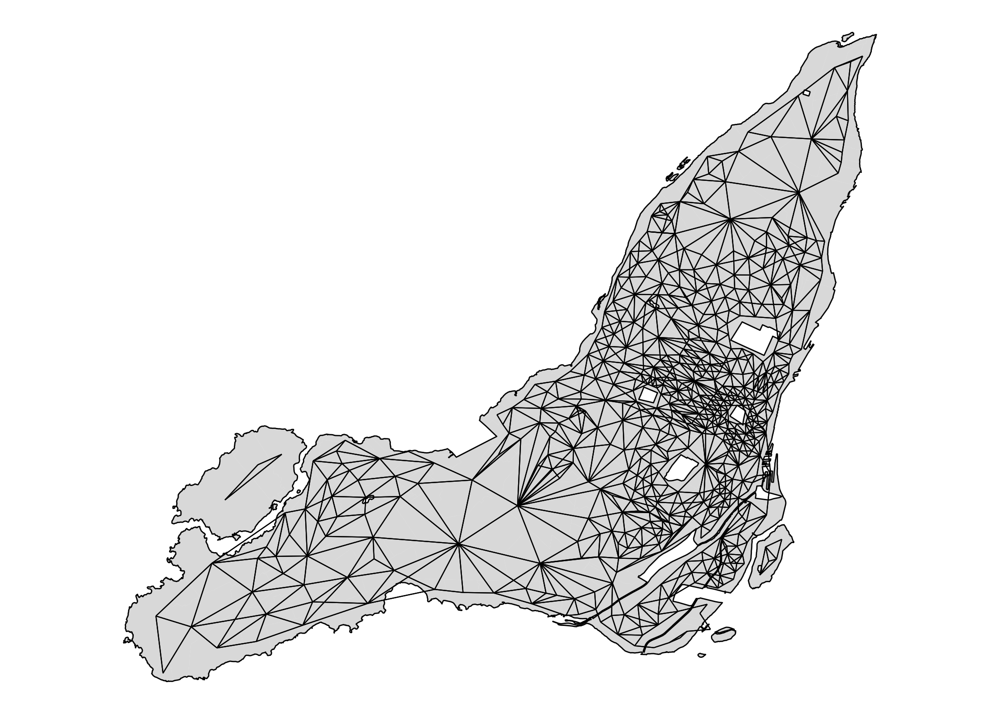
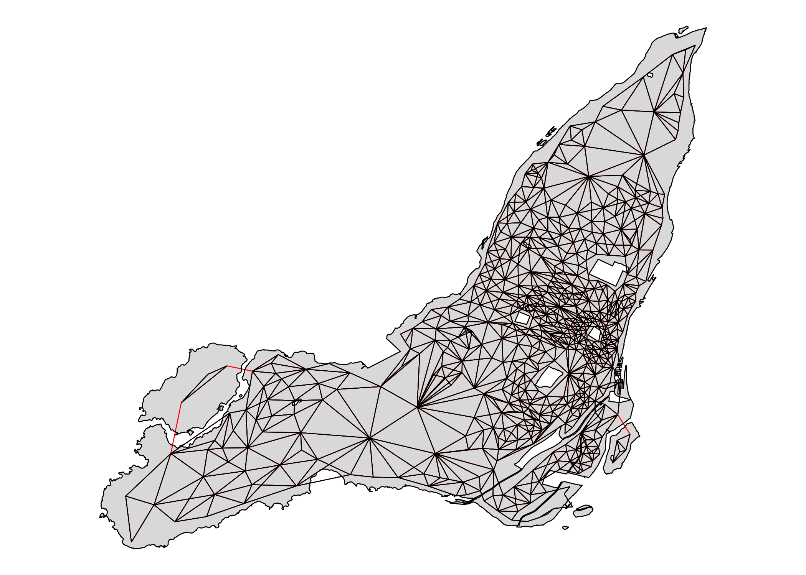
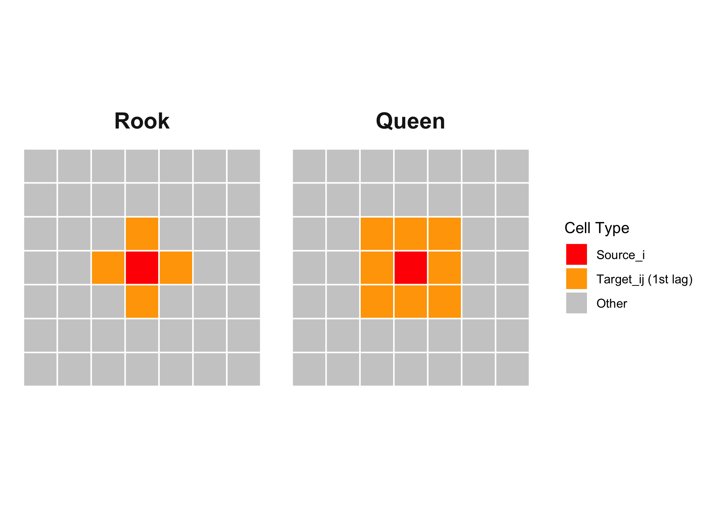
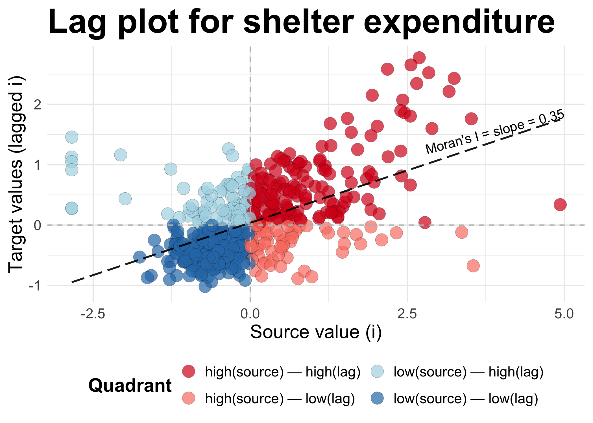
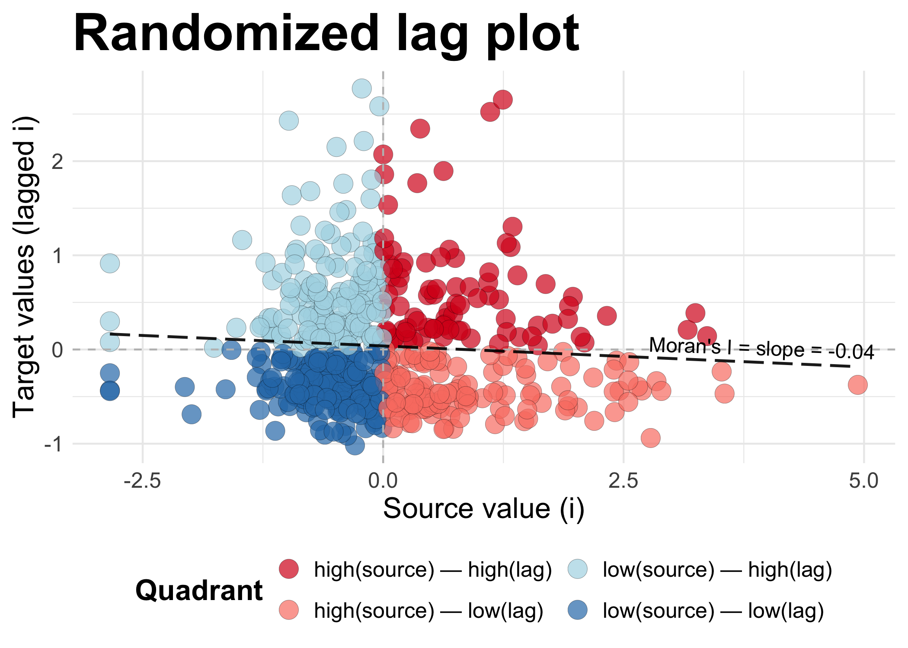
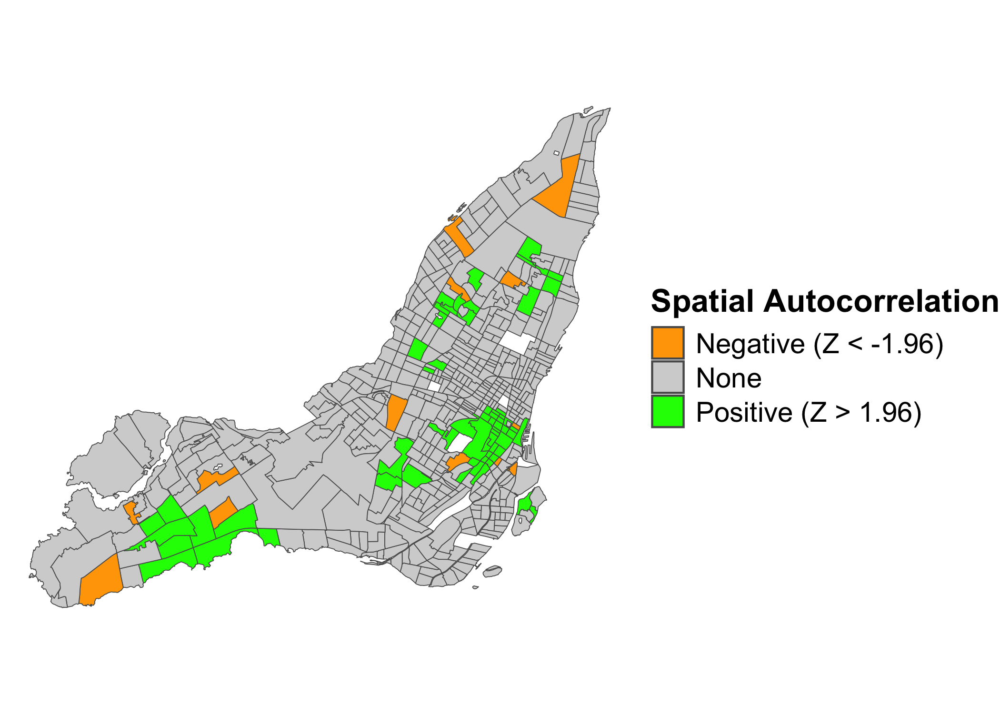
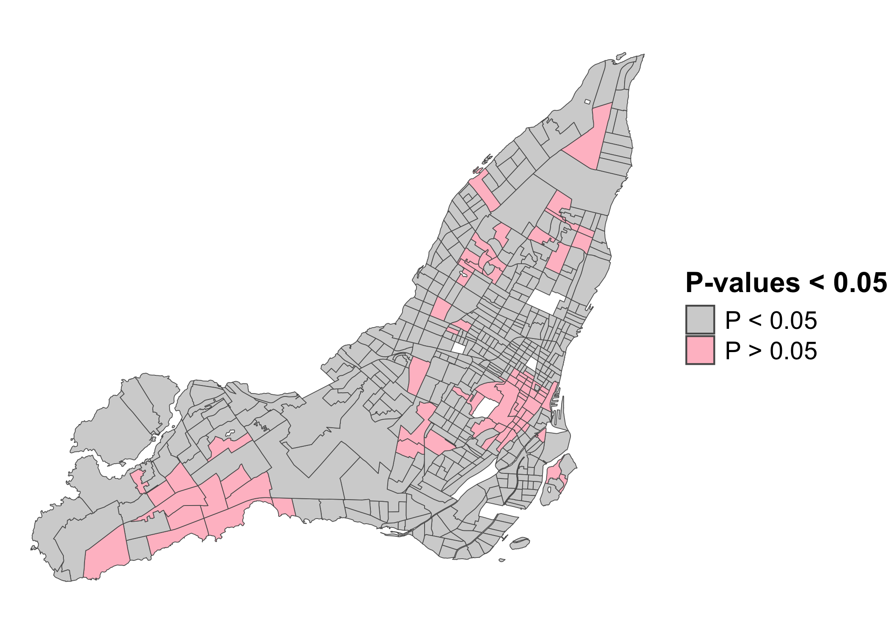

<!-- Katex -->
<link
  rel="stylesheet"
  href="https://cdn.jsdelivr.net/npm/katex@0.15.2/dist/katex.min.css"
  integrity="sha384-MlJdn/WNKDGXveldHDdyRP1R4CTHr3FeuDNfhsLPYrq2t0UBkUdK2jyTnXPEK1NQ"
  crossorigin="anonymous"
/>


<style>
.cell-output.cell-output-stdout pre code {
    background-color: #22272e !important; /* Match code block background */
    color: #adbac7 !important;           /* Match text color */
    padding: 1em;
    border-radius: 5px;
    font-family: monospace;
    overflow-x: auto;
    white-space: pre-wrap; /* Ensure long text wraps */
}
</style>

<style>
  details > summary {
    color: grey;
    cursor: pointer; /* Optional: improves UX by showing it's clickable */
  }
</style>

<style>
/* Define CSS variables for your colors */
:root {
  --red: red;
  --orange: orange;
  --lightyellow: lightyellow;
  --grey80: grey80;
  --red2: #d7191c;
  --salmon: salmon;
  --blue: #2c7bb6;  /* renamed from "#2c7bb6" to a valid variable name */
  --lightblue: lightblue;
  --lightgrey: lightgrey;
  --purple: #b392f0;
};/* Create CSS classes that use the above variables */
.color-red       { color: var(--red); }
.color-orange    { color: var(--orange); }
.color-lightyellow {
    color: var(--lightyellow);
    -webkit-text-stroke: 0.25px black;
}
.color-lightgrey {
    color: var(--lightgrey);
    -webkit-text-stroke: 0.25px black;
}
.color-grey80    { color: var(--grey80); }
.color-red2   { color: var(--red2); }
.color-salmon   { color: var(--salmon); }
.color-blue    { color: var(--blue); }
.color-lightblue { color: var(--lightblue); }
.color-purple { color: var(--purple); }
</style>

This winter I am co-teaching a [GIS course](https://www.mcgill.ca/study/2024-2025/courses/urbp-505) at the McGill School of Urban Planning. After confusing my students with a lecture on Moran’s $I$, I thought I’d best come back to the concept and try to clarify it a bit.

Moran’s I is one of those ubiquitous concepts which permeate any field of applied quantitative research: Everyone uses it, but most of us would be unable to explain it in detail. Here, I am going to try to break it down through some visualizations and equations. The first part of the tutorial focuses on the Global Moran’s I, the second on it’s Local variant. In both sections, I will start with buildign a visual intuition, and then dive into the underlying Math.

### Global Moran’s $I$

#### Spatial Autocorrelation

The fundamental problem that Moran’s I tries to tackle is that of *spatial autocorrelation*, following Tobler’s famous [“First Law of Geography”](https://en.wikipedia.org/wiki/Tobler%27s_first_law_of_geography):

> Everything is related to everything else, but near things are more related than distant.

This is not a complicated idea, it simply states that things in space tend to be grouped together. Let’s take an example. I want to see how shelter costs (rent + utilities) are distributed across Montreal. What kind of spatial pattern is there? For this purpose, I use Canadian census data from 2021.

I am going to hide codeblocks that are inessential for the tutorial and/or very long and complicated. Feel free to look at them if that helps!

#### Data and libraries

I start by loading all the necessary data and libraries.

<details class="code-fold"><summary>Code</summary>

``` r
library(tidyverse)
library(cancensus)
library(sf)
library(spdep)
```
</details>

I use census data accessed with the `cancensus package`. To you use it you need to [setup an API key](https://mountainmath.github.io/cancensus/).

<details class="code-fold">
<summary>Code</summary>

``` r
data_2021 <- 
  get_census(
    "CA21", list(CD = "2466"), 
    vectors = c("v_CA21_4317", "v_CA21_560", "v_CA21_4315
"),
    level = "CT", geo_format = "sf") |> 
  select(GeoUID,
         shelter_30_2021 = `v_CA21_4315\n: % of tenant households spending 30% or more of its income on shelter costs (55)`) |>
  as_tibble() |>
  st_as_sf()

data_2021 <- data_2021 |> 
  filter(!is.na(shelter_30_2021)) |>
  tibble::rowid_to_column("id")

data_2021 |> head()
```

</details>

Now we have the variable of interest, which is `v_CA21_4315\n: % of tenant households spending 30% or more of its income on shelter costs`. This is the percentage of tenants in each tract that spend 30% or more on shelter costs. We would expect this value to have a distinct spatial pattern. Looking at a map of the variable, what do you think?

<details class="code-fold">
<summary>Code</summary>

``` r
get_island_outlines <- function(data) {
  all_islands <- st_union(data)
  island_outlines <- st_cast(all_islands, "POLYGON")
  return(island_outlines)
}

island_outlines <- get_island_outlines(data_2021)
```

</details>

<details class="code-fold">
<summary>Code</summary>

``` r
data_2021 |> 
  ggplot(aes(fill = shelter_30_2021)) +
  geom_sf() +
  geom_sf(data = island_outlines, fill = NA, color = "black", linewidth = 0.15) +
  scale_fill_gradientn(
    name = "Tenants paying > 30% for shelter",
    colors = viridis::viridis(10)
  ) +
   theme_void() +
  theme(
    legend.position = "bottom",
    legend.title = element_text(face = "bold", size = 16),
    legend.text = element_text(size = 14)
  )
```

</details>


It looks like shelter costs indeed have a spatial pattern. How pronounced is this pattern? The answer doesn’t seem obvious. Luckily, Moran’s $I$ is the first tool for asking this question. We can calculate this $I$ using various R libraries. One common choice is `spdep`. Whatever library we use, we first need to define what counts as “nearby” on our map. I will use queen adjacency, which works like this:

``` r
nb_queen <- spdep::poly2nb(data_2021, queen = T)
```

    Warning in spdep::poly2nb(data_2021, queen = T): neighbour object has 3 sub-graphs;
    if this sub-graph count seems unexpected, try increasing the snap argument.

Notice the warning: `neighbour object has 3 sub-graphs`. Our weights matrix isn’t fully connected because L’Île Bizard and Nuns Island are separate from the rest of Montreal. I’ve created a few custom functions to get and map the links between census tracts. The initial queens adjacency structure connects census tracts like this:

<details class="code-fold">
<summary>Code</summary>

``` r
get_links <- function(data, nb) {
  centroids <- sf::st_centroid(data)
  centroid_coords <- sf::st_coordinates(centroids)
  links_sp <- spdep::nb2lines(nb, coords = centroid_coords)
  links_sf <- sf::st_as_sf(links_sp)
  links_sf <- sf::st_set_crs(links_sf, st_crs(data))
  return(links_sf)
}

plot_adjacency <- function(nb, data, island_outlines) {
  links_sf <- get_links(data, nb)
  ggplot() +
    # Plot the polygons
    geom_sf(data = data, fill = "grey", color = NA, 
          linewidth = 0.3, alpha=0.5) +
    # Overlay the neighbor links in red
    geom_sf(data = links_sf, color = "black", linewidth = .25) +
    geom_sf(data = island_outlines, fill = NA, color = "black", linewidth = 0.3) +
    theme_void()
}

plot_adjacency_comp <- function(nb1, nb2, data) {
  links1 <- get_links(data, nb1)
  links2 <- get_links(data, nb2)
  island_outlines <- get_island_outlines(data)
  ggplot() +
    # Plot the polygons
    geom_sf(data = data, fill = "grey", color = NA, 
          linewidth = 0.3, alpha=0.5) +
    # Overlay the neighbor links in red
    geom_sf(data = links2, color = "red", linewidth = .25) +
    geom_sf(data = links1, color = "black", linewidth = .25) +
    geom_sf(data = island_outlines, fill = NA, color = "black", linewidth = 0.3) +
    theme_void()
}
```

</details>

<details class="code-fold">
<summary>Code</summary>

``` r
plot_adjacency(nb_queen, data_2021, island_outlines)
```

</details>



As you can see, the two above-mentioned islands are indeed disconnected from the rest of Montreal. We need to connect them. Using the `tmap` package I find the ID’s of the disconnected census areas and add them manually.

``` r
tmap::tmap_mode("view")  # Switch to interactive mode
tmap::tm_shape(data_2021) +
  tmap::tm_polygons(alpha = 0.5, id = "id")
```

Having identified good candidates for making the connection, we can use the `addlinks1` function to actually do it:

``` r
nb_queen_plus <- nb_queen
nb_queen_plus <- spdep::addlinks1(nb_queen_plus, 451, 468)
nb_queen_plus <- spdep::addlinks1(nb_queen_plus, 444, 469)
nb_queen_plus <- spdep::addlinks1(nb_queen_plus, 76, 337)

summary(nb_queen_plus)
```

``` r
Neighbour list object:
Number of regions: 529 
Number of nonzero links: 3142 
Percentage nonzero weights: 1.12278 
Average number of links: 5.939509 
Link number distribution:

  1   2   3   4   5   6   7   8   9  10  11  12  13  15  16 
  1  10  43  71  96 122  91  48  24  12   4   3   1   2   1 
1 least connected region:
61 with 1 link
1 most connected region:
407 with 16 links
```

Now, having added the links (in **<span style="color:red;">red</span>**), we get this adjacency map:

<details class="code-fold">
<summary>Code</summary>

``` r
plot_adjacency_comp(nb_queen, nb_queen_plus, data_2021)
```

</details>



It is fully connected. We have what we need now to count Moran’s I! To calculate Moran’s I with `spdep` we use the `moran.test` function. As input, it requires (1) our variable of interest and (2) the spatial weights of our neighbourhood object. We create the latter using the `nb2list2` function. We set `style = W` in order to make sure that the weight of the links between each area and its neighbors sums to $1$. I will go more into this detail below, in the Math part of the tutorial.

``` r
nbw <- spdep::nb2listw(nb_queen_plus, style = "W")
gmoran <- spdep::moran.test(data_2021$shelter_30_2021, nbw,
                            alternative = "two.sided")
gmoran
```

``` r

	Moran I test under randomisation

data:  data_2021$shelter_30_2021  
weights: nbw    

Moran I statistic standard deviate = 13.385, p-value < 2.2e-16
alternative hypothesis: two.sided
sample estimates:
Moran I statistic       Expectation          Variance 
     0.3466502744     -0.0018939394      0.0006781103 
```

Having fitted `moran.test` to our data, we get our Moran’s I value. It is `0.3467` and statistically significant at `p < 2.2e-16`. What does this all mean? I will start with a **visual** exploration of the concept, before diving into the Math.

#### Understanding Moran’s I <span class="color-purple">visually</span>

The core question that Moran’s I is trying to answer is this: On average, is there a pattern to how different values are located near each other in space. The pattern could be **dispersion** (negative autocorrelation), **clustering** (positive autocorrelation), or **random** (no autocorrelation). The range for Moran’s I is between $-1$ and $1$, with values below $-0.3$ generally indicating dispersion, values above $0.3$ indicating clustering, and values in between them a random pattern. Since our Moran’s I is `0.3467`, our data displays positive autocorrelation in the form of clustering.

In order to calculte this value, we need some definition of “near”. It is this threshold of what is near that we set above with `spdep`. It’s key for understanding Moran’s I, so let’s take a closer look at it. The traditional way of illustrating the concept of adjacency is using the following grid.



Here our “source” area of interest is marked in **<span class="color-red">red</span>** and it’s neighbors or “targets” are marked in **<span class="color-orange">orange</span>** These are first-order neighbors, but we could also define neighbors in the second order, like the **<span class="color-lightyellow">yellow</span>** squares below:


With “queen” adjacency, the neighbors of the source are all areas that share a border *or* a corner with the source. With “rook” adjacency, only areas that share a border count as neighbors.

Once we have decided on the neighbors, we can get to the point: What is the relationship between the values in the source and the target. Here, given the source, we call the values in the target areas the **lagged values** of the source. What Moran’s I does, is to inspect the relationship between the values in each target (i.e. each square in the grid) and all their lagged values. Through this comparison, a plot similar to the one below is often presented:

<details class="code-fold">
<summary>Code</summary>

``` r
create_lag <- function(data, var_nam) {
  data <- mutate(data, var_std = as.numeric(scale(data[[var_nam]]))) 
  data$lag_var <- spdep::lag.listw(nbw, data$var_std)
  return(data)
}

set_quadrants <- function(data) {
  data <- data |>
    mutate(quadrant = case_when(
      var_std > 0 & lag_var > 0   ~ "high(source) — high(lag)",
      var_std > 0 & lag_var < 0   ~ "high(source) — low(lag)",
      var_std < 0 & lag_var < 0   ~ "low(source) — low(lag)",
      var_std < 0 & lag_var > 0   ~ "low(source) — high(lag)",
      TRUE                      ~ NA_character_  
    ))
  return(data)
}
```

</details>

<details class="code-fold">
<summary>Code</summary>

``` r
data_2021 <- create_lag(data_2021, "shelter_30_2021")
data_2021 <- set_quadrants(data_2021)
```

</details>

<details class="code-fold">
<summary>Code</summary>

``` r
plot_scatter <- function(data, title) {
  # Fit the linear model
  fit <- lm(lag_var ~ var_std, data = data)
  intercept <- coef(fit)[1]
  slope <- coef(fit)[2]
  
  # Create the annotation label using only the x coefficient.
  # Here, we use the Greek letter beta (β) to denote the coefficient.
  label_text <- sprintf("Moran's I = slope = %.2f", slope)
  
  # Choose a point along the regression line.
  # Here, we use the median x-value.
  mid_x <- max(data$var_std) - 1
  mid_y <- intercept + slope * mid_x
  
  # Compute the angle (in degrees) of the regression line.
  angle_deg <- atan(slope) * 140 / pi
  
  ggplot(data, aes(x = var_std, y = lag_var)) +
    geom_point(aes(fill = quadrant), 
               shape = 21, size = 5, stroke = 0.1, 
               alpha = 0.7, color = "black") +
    geom_hline(yintercept = 0, linetype = "dashed", color = "gray") +
    geom_vline(xintercept = 0, linetype = "dashed", color = "gray") +
    geom_line(stat = "smooth", method = "lm", formula = y ~ x,
              size = 0.75, linetype = "longdash", alpha = 0.9) +
    # Place the annotation at (mid_x, mid_y) and rotate it to match the line.
    annotate("text", 
             x = mid_x, 
             y = mid_y, 
             label = label_text,
             size = 4, 
             angle = angle_deg,
             hjust = 0.5, 
             vjust = -0.5) +
    scale_fill_manual(values = c("high(source) — high(lag)" = "#d7191c", 
                                 "high(source) — low(lag)"  = "salmon",
                                 "low(source) — low(lag)"   = "#2c7bb6",
                                 "low(source) — high(lag)"  = "lightblue")) +
    labs(title = title,
         x = "Source value (i)",
         y = "Target values (lagged i)",
         fill = "Quadrant") +
    theme_minimal() +
    theme(
      title = element_text(size = 24, face = "bold"),
      legend.title = element_text(size = 16, face = "bold"),
      legend.text = element_text(size = 12),
      axis.title = element_text(size = 16, face = "plain"),
      axis.text = element_text(size = 12),
      legend.position = "bottom",
      plot.margin = margin(.25, .25, .25, .25, unit = "cm")
    ) +
    guides(fill = guide_legend(nrow = 2))
}
```

</details>

<details class="code-fold">
<summary>Code</summary>

``` r
plot_scatter(data_2021, "Lag plot for shelter expenditure")
```

</details>



Now, let’s dwell on this plot for a minute. On the **x-axis** we have all the source values. For each area $i$, we have simply recorded the value in the area. Next, on the **y-axis**, we have the values of all the $j$ neighbors of each $i$, the “lag of $i$”. These y-values are formed through a normalized sum: We have added the lagged values and then divided them by the total number $n_{ij}$ of neighbors each $i$ has.

When both the source and it’s lagged target values are high, we get in the **<span class="color-red2">dark red</span>** quadrant in the upper right corner. When they are both low, we get in the **<span class="color-blue">dark blue</span>** quadrant on the lower left. Both **<span class="color-red2">dark red</span>** and **<span class="color-blue">dark blue</span>** points combine to a higher Moran’s I: They are an indivation of clustering among high (**<span class="color-red2">dark red</span>**) or low (**<span class="color-blue">dark blue</span>**) values. The other two quadrants are where neighbors are dispresed: high values tend to be located nexts to low values (**<span class="color-salmon">light red</span>**), and vice versa (**<span class="color-lightblue">light blue</span>**).

In our case, there is clustering, so Moran’s I is positive, `0.3467`. This value is, as we will see when we get to the math below, the **slope** of the line in the scatter plot above. Moran’s I is the slope of this plot. Because values are clustered, the slope is positive. *If* the pattern would be dispersed, *then* we would see more points in the **<span class="color-salmon">light red</span>** and **<span class="color-lightblue">light blue</span>** quadrants: The slope would be negative. If we had a similar distribution of clustered *and* disperesed values, the slope would be near zero.

Consider this carefully. In the scatter plot below, I have *randomized* the lagged values. This means that it’s (almost) entirely random whether high and low values are next to each other. What we get is a slope that at `-0.04`is near zero. There is a tiny bit of dispersal (the slope is negative), but the value is too close to zero to actually say the data is dispersed.

<details class="code-fold">
<summary>Code</summary>

``` r
set.seed(42)

data_randomized <- data_2021
data_randomized <- create_lag(data_randomized, "shelter_30_2021")
data_randomized$lag_var <- sample(data_randomized$lag_var)
data_randomized <- set_quadrants(data_randomized)

plot_scatter(data_randomized, "Randomized lag plot")
```

</details>



We can also look at a map of these same values in order to make sense of it all. Using the original (non-randomized data), we get the following map:

<details class="code-fold">
<summary>Code</summary>

``` r
ggplot() +
  geom_sf(data = data_2021, aes(fill = quadrant), 
          color = "grey", size = 0.1, alpha = 0.7) +
  scale_fill_manual(values = c("high(source) — high(lag)" = "#d7191c",
                               "high(source) — low(lag)"  = "salmon", 
                               "low(source) — low(lag)"   = "#2c7bb6", 
                               "low(source) — high(lag)"  = "lightblue")) +
  geom_sf(data = island_outlines, fill = NA, color = "black", linewidth = 0.15) +
  labs(fill = "Quadrant") +
  theme_void() +
  theme(
    legend.title = element_text(size=16, face="bold"),
    legend.text = element_text(size=12),
    legend.position = "bottom",
    plot.margin = margin(.25, .25, .25, .25, unit = "cm")
  ) +
  guides(fill = guide_legend(nrow = 2))
```

</details>


Notice how **<span class="color-red2">dark red</span>** and **<span class="color-blue">dark blue</span>** values tend to be grouped together. This is because they are *by definition* areas where similar values are grouped together. By contrast, the **<span class="color-salmon">light red</span>** and **<span class="color-lightblue">light blue</span>** values are areas of dispersal. In this case, Moran’s I is positive because clustered values (whether high or low) are grouped together.

Next I will move to consider Moran’s $I$ mathematically. If you want to skip this section, feel free to do so and jump straight to the section on the `Local` Moran’s $I$.

#### Understanding Moran’s $I$ <span class="color-purple">mathematically</span><br> <span style="color:grey;">(1st Interpretation)</span>

<details>
<summary>
Read it
</summary>

Having a visual sense of what Moran’s I does, let’s dive into the Math a bit. There are different ways of writing the equation for Moran’s I. My preference is the following:

$$
I = \frac{\sum_{i}\sum_{j} w_{ij}z_iz_j}{\sum_{i}\sum_{j} w_{ij}}
$$

Where $I$ is Moran’s I, $w_{ij}$ is the weights matrix denoating all the adjacency relations in our study area, $z_i$ is the *standardized* value of our variable of interest in target area $i$, and $z_j$ are the *standardized* lagged values of the $j$ neighbors of $i$. What we have here, is the spatial covariance (nominator) divided by a normalizing sum (denominator) of all the weights in our weight matrix:

$$
I = 
\frac{
\overbrace{\sum_{i}\sum_{j}w_{ij}z_iz_j}^{\text{Spatial covariance}}
}{
\underbrace{\sum_{i}\sum_{j}w_{ij}}_{\text{Normalization}}
}
$$

Let’s simplify the denominator. *If* we have already normalized our weights matrix $w_{ij}$, *then* the denominator is just the total number $N$ of sources in our study area:

$$
I = 
\frac{
\overbrace{\sum_{i}\sum_{j}w_{ij}z_iz_j}^{\text{Spatial covariance}}
}{
\underbrace{N}_{\text{Normalization}}
}
$$

This normalization implies that the sum of the weights $w_{ij}$ for each $i$ is one. In `spdep`, we do this by setting `style = W`i in `nb2listw()`, which is what we did above. When we sum over $w_{ij}$ we just get the total number $N$ of areas $i$.

The standardized values of our sources $i$ and targets $j$ are just each value $x_i$ and $x_j$ subtracted by the overall mean $\bar{x}$ and divided by the standard deviation $\sigma$:

$$
z_i = \frac{x_i - \bar{x}}{\sigma} \hspace{2em} z_j = \frac{x_j - \bar{x}}{\sigma}
$$

These all add up to the spatial covariance:

$$
\operatorname{Spatial covariance} = \sum_{i}\sum_{j}w_{ij}z_iz_j
$$

What is happening here? In words, we are (1) going over each area $i$, then (2) multiplying its standardized value ($z_i$) with the standardized “lagged” value ($z_j$) of each of its neighbors $j$. We multiply each of these products with the weight matrix $w_{ij}$. Then, we (3) sum these values for each area ($\sum_j$) and then (4) sum all these sums ($\sum_i$).

After (5) normalizing (division by $N$), we get the global Moran’s I value:

$$
I = \frac{\sum_{i}\sum_{j}w_{ij}z_iz_j}{N}
$$

The Moran’s $I$ is simply the normalized sum of all the products between our values $z_i$ and their lagged values.

</details>

#### Understanding Moran’s $I$ <span class="color-purple">mathematically</span><br><span style="color:grey;">(2nd Interpretation)</span>

<details>
<summary>
Read it
</summary>

Notice above that Moran’s $I$ was also the slope that traces the relationship between $z_i$ values and their lagged values. This is a second useful interpretation of Moran’s $I$. Let’s write the lagged values of $z_i$ simply as:

$$
\operatorname{lag}(z_i) = \sum_{j} w_{ij}z_j
$$ $$
I = \frac{\sum_{i} z_i \operatorname{lag}(z_i)}{N}
$$

Let’s try to get from this definition to something where $I$ could be interpreted as the slope connecting $z_i$ to $\operatorname{lag}(z_i)$. We can start by noting that:

$$
N = \sum_i z_{i}^2
$$

Why is this? Because summing over the square of a standardized value, we get *approximately* the sample size $N$. This is a basic property of standardized data and gives us:

$$
I = \frac{\sum_{i} z_i \operatorname{lag}(z_i)}{\sum_i z_{i}^2} = \frac{\operatorname{lag}(z_i)}{z_{i}} 
$$

This, in turn, gives us:

$$
\operatorname{lag}(z_i) = Iz_{i}
$$

I.e. Moran’s I is the coeficient regressing the values $z_i$ of targets $i$ against their $\operatorname{lag}(z_i)$. In other words, Moran’s I is the slope connecting the value in an area to the summed values of its neighbors.

</details><br>

### 2. Local Moran’s $I_i$

So far, we have considered Moran’s $I$ as a global property. In this guise, it answers two simple questions: (1) Is there spatial autocorrelation in our data and (2) how much? What it doesn’t tell us, is *where* the autocorrelation is occurring and in *what kind of patterns* (beyond the general observation that it’s positive or negative, clustered or dispersed). In order to explore these questions, we need to turn to the Local Moran’s $I_i$.

Note the $i$ index here. It signals to us what Local Moran’s $I_i$ is all about: The lag of some value in each $i$ area in our total area of interest.

To calculate the Local Moran’s $I_i$ values, we can once again use `spdep`:

``` r
lmoran <- localmoran(data_2021$shelter_30_2021, 
                     nbw, 
                     alternative = "two.sided")
```

Just like before, we use our variable of interest, the weights in `nbw`, and we test for both negative and positive autocorrelation by setting `alternative = "two.sided"`. In return, we get the following, somewhat confusing output:

``` r
summary(lmoran)
```

``` r
       Ii                 E.Ii                Var.Ii             Z.Ii        
 Min.   :-4.146530   Min.   :-0.0462212   Min.   :0.00000   Min.   :-3.8921  
 1st Qu.:-0.007483   1st Qu.:-0.0016046   1st Qu.:0.01387   1st Qu.:-0.1399  
 Median : 0.129577   Median :-0.0006318   Median :0.05619   Median : 0.7431  
 Mean   : 0.346650   Mean   :-0.0018939   Mean   :0.19018   Mean   : 0.7558  
 3rd Qu.: 0.389070   3rd Qu.:-0.0001421   3rd Qu.:0.17107   3rd Qu.: 1.4668  
 Max.   : 7.903196   Max.   : 0.0000000   Max.   :7.74413   Max.   : 7.4394  
 Pr(z != E(Ii))  
 Min.   :0.0000  
 1st Qu.:0.1120  
 Median :0.3368  
 Mean   :0.3726  
 3rd Qu.:0.5855  
 Max.   :0.9930  
```

What are these? Let’s take a look at the key outputs that we will actually use:

- **Ii:** Local Moran’s $I_i$ for observation $i$
- **Z.Ii:** Standardized Score (z-value) for $I_i$
- **Pr(z \> E(Ii)):** P-value for each $I_i$

Then there are some other values, which are interesting but we won’t actually be using them here:

- **E.Ii:** Expected Value of $I_i$ under the Null Hypothesis
- **Var.Ii:** Variance of $I_i$ under the Null Hypothesis

## Understanding Local Moran’s $I_i$ <span class="color-purple">visually</span>

Let’s again start with building visual intuition. The purpose of the Local Moran’s $I_i$ is usually to explore what is known as **LISA-clusters**, short for **[“Local Indicators of Spatial Association”](https://onlinelibrary.wiley.com/doi/10.1111/j.1538-4632.1995.tb00338.x)**. Typically, these clusters are visuallized as follows:


What this map shows, is clusters of high and low values, along with areas where dispersal is occuring due to neighboring dissimilar values. The grey areas are not statistically significant. It’s a very useful map, and very commonly used in empirical spatial research on issues ranging from [income inequality and transit justice](https://journals.sagepub.com/doi/abs/10.1177/0308518X231162091) to [changes in land use](https://www.sciencedirect.com/science/article/pii/S0169204616300597).

This map shows the results of a three-step algorithm. I will use some Math notation here which I introduced above in the sections of the Math of the Global Moran’s $I$. If you want a more rigorous definition of this notation, go back to that section.

The algorithm progresses as follows:

1.  For each area $i$, compare its standardized value $z_i$ to the lagged sum $lag(z_i)$
2.  Based on the comparison, sort $i$ into one of four categories:
    1.  **<span class="color-red2">High-high</span>**, if $z_i > 0$ and $\operatorname{lag(z_i)} > 0$
    2.  **<span class="color-salmon">High-low</span>**, if $z_i > 0$ and $\operatorname{lag(z_i)} < 0$
    3.  **<span class="color-blue">Low-low</span>**, if $z_i < 0$ and $\operatorname{lag(z_i)} < 0$
    4.  **<span class="color-lightblue">Low-high</span>**, if $z_i < 0$ and $\operatorname{lag(z_i)} > 0$
3.  Check p-values for each $i$ and exclude areas under statistical significance threshold (e.g. $0.05$). If an area doesn’t cross the threshold of statistical significance, it is discarded from the analysis (i.e. marked as **<span class="color-lightgrey">grey</span>** in the above map).

While this map looks in many ways similar to our map of the individual components of Global Moran’s $I$, it is not the same thing. Let’s go over, step-by-step, how we get to this map. For this, we need to move into the Math a bit.

#### Understanding Local Moran’s $I_i$ <span class="color-purple">visually</span> & <span class="color-purple">mathematically</span>

We begin by adding the relevant values from the `lmoran` object to our data:

``` r
data_2021$lmI <- lmoran[, "Ii"] |> unname() # local Moran's I
data_2021$lmZ <- lmoran[, "Z.Ii"] |> unname()# z-scores local Moran's I
data_2021$lmp <- lmoran[, "Pr(z != E(Ii))"] |> unname() # p-values 
```

Now, we can look at the first variable of interest, the raw local values in `lmI`:

<details class="code-fold">
<summary>Code</summary>

``` r
data_2021 |> 
  ggplot(aes(fill = lmI)) +
  geom_sf() +
  # Change to different color scales here
  scale_fill_gradientn(
    name = "Local Moran's I",
    labels = scales::comma,
    colors = viridis::viridis(10)
  ) +
  theme_void() +
  theme(
    legend.title = element_text(size=16, face="bold"),
    legend.text = element_text(size=14)
  )
```

</details>


What do these values describe? They are the outputs of the function for Local Moran’s $I_i$, i.e. the the product of the standardized values in each area $i$ with the standardized values of their neighbors in areas $ij$. Check the mathematical aside, for details on this.

<details>
<summary>
Local Moran’s I Math
</summary>

The Local Moran’s $I_i$ can be defined as:

$$
I_i = z_i \operatorname{lag}(z_i)
$$

In other words, each Local Moran’s $I_i$ value, is the product of the *standardized* value of our variable of interest in area $i$ and the sum of the *standardized* lagged values around it, in it’s neighbors $ij$. If we standardize this value itself, we get:

$$
Z_{I_i} = \frac{I_i - E(I_i)}{\sigma_{I_i}} = \frac{I_i - \bar{I_i}}{\sigma_{I_i}}
$$ 

Using these Z-values of the Moran’s $I_i$, we have the distribution from which we can get our p-value thresholds for testing the null hypothesis that the Local Moran’s $I_i$ values come from a random distribution, rather than the one we are seeing here.

</details>


This is how the z-scored Local Moran’s $I_i$ values are distributed:

<details class="code-fold">
<summary>Code</summary>

``` r
data_2021 |> 
  ggplot(aes(fill = lmZ)) +
  geom_sf() +
  scale_fill_gradientn(
    name = "Z-score",
    labels = scales::comma,
    colors = viridis::viridis(10)
  ) +
  theme_void() +
    theme(
    legend.title = element_text(size=16, face="bold"),
    legend.text = element_text(size=14)
  )
```

</details>


If we consider any Z-score above $1.96$ to indicate clustering and below $1.96$ to indicate dispersal, we get the following map:

<details class="code-fold">
<summary>Code</summary>

``` r
data_2021 <- data_2021 |>
  mutate(lmZ_cat = case_when(
    lmZ <= -1.96 ~ "neg",
    lmZ >= 1.96 ~ "pos",
    .default = "none"
  )) |>
  mutate(lmp_cat = ifelse(lmp < 0.05, T, F))

data_2021 |> 
  ggplot(aes(fill = lmZ_cat)) +
  geom_sf() +
  scale_fill_manual(
    name = "Spatial Autocorrelation",
    values = c("neg"="orange", "none"="lightgrey", "pos"="green"),
    labels = c("Negative (Z < -1.96)", "None", "Positive (Z > 1.96)")
  ) +
  theme_void() +
    theme(
    legend.title = element_text(size=16, face="bold"),
    legend.text = element_text(size=14)
  )
```

</details>



Here, the orange values indicate dispersal and the green values clustering. However, this is not as granular as the LISA-clusters. It only tells us where there is significant clustering or dispersal. It does not tell us if (a) the clustering is between positive (**<span class="color-red2">High-high</span>**) or negative (**<span class="color-blue">Low-Low</span>**) values, nor does it (b) tell us if the dispersal is between **<span class="color-salmon">high-low</span>** or **<span class="color-lightblue">low-high</span>** values.

However, using these Z-values, we can generalize to the following p-value map:

<details class="code-fold">
<summary>Code</summary>

``` r
data_2021 |> 
  ggplot(aes(fill = lmp_cat)) +
  geom_sf() +
  scale_fill_manual(
    name = "P-values < 0.05",
    values = c("TRUE"="pink", "FALSE"="lightgrey"),
    labels = c("P < 0.05", "P > 0.05")
  ) +
  theme_void() +
    theme(
    legend.title = element_text(size=16, face="bold"),
    legend.text = element_text(size=14)
  )
```

</details>



This is where there is significant clustering or dispersal. Now, using these p-values, we can finally get the LISA-clusters. We need three components:

1.  The p-values (above)
2.  The standardized $z_i$ values
3.  The standardized $\operatorname{lag}(z_i)$ values

We already have **component \#1**. For **component \#2**, we can use the custom function below, which basically replicates the `scale` function in R:

``` r
standardize_variable <- function(data, variable) {
  # Standardize the variable values to obtain z-scores
  x <- data[[variable]]
  data$z <- (x - mean(x)) / sd(x)
  return(data)
}

data_2021 <- standardize_variable(data_2021, "shelter_30_2021")
```

For **component \#3**, we need to get the lagged values of each area $i$. For this, we can use the `lag.listw` function in `spdep`. To make things more simple, I’ve wrapped it in a function:

``` r
lag_variable <- function(data, neighborhood) {
  # Compute the spatial lag of the standardized values using the spatial weights
  data$lagz <- spdep::lag.listw(neighborhood, data$z)
  return(data)
}

data_2021 <- lag_variable(data_2021, nbw)
```

Now we have all the components: (1) The standardized values of our variable, (2) the standardized lag-values, (3) and the p-values for each area $i$. We can calculate the LISA clusters with the following function:

``` r
get_LISA_clusters <- function(data, lmoran, p_value = 0.05) {
# Set the LISA-clusters
  data$LISA_cluster <- NA
  data$LISA_cluster[
    data$z > 0 & data$lagz > 0 & lmoran[,"Pr(z != E(Ii))"] < p_value] <- "High-High"
  data$LISA_cluster[
    data$z < 0 & data$lagz < 0 & lmoran[,"Pr(z != E(Ii))"] < p_value] <- "Low-Low"
  data$LISA_cluster[
    data$z > 0 & data$lagz < 0 & lmoran[,"Pr(z != E(Ii))"] < p_value] <- "High-Low"
  data$LISA_cluster[
    data$z < 0 & data$lagz > 0 & lmoran[,"Pr(z != E(Ii))"] < p_value] <- "Low-High"
  data$LISA_cluster[is.na(data$LISA_cluster)] <- "Not Significant"
  
  # Return the data with the LISA-clusters
  return(data)
}

data_2021 <- get_LISA_clusters(data_2021, lmoran)
```

Notice, how we use `lmoran[,"Pr(z != E(Ii))"]` and compare it to a `p_value  = 0.05` to settle which rows in the data belong to which LISA-cluster. And now we can map it:

<details class="code-fold">
<summary>Code</summary>

``` r
data_2021 |> 
  ggplot(aes(fill = LISA_cluster)) +
  geom_sf() +
  scale_fill_manual(
    name = "Lisa Clusters",
    values = c("Low-Low"="#2c7bb6", 
               "Low-High"="lightblue", 
               "High-High"="#d7191c", 
               "High-Low"="salmon", 
               "Not Significant"="lightgrey"),
    #labels = c("Negative SAC", "No SAC", "Positive SAC")
  ) +
  theme_void() +
    theme(
    legend.title = element_text(size=16, face="bold"),
    legend.text = element_text(size=14)
  )
```

</details>


### Bringing it all together

What have we learned about the distribution of relative shelter costs? Using the Global Moran’s $I$, we learned that they are significantly clustered. We also got a first sense of how these values are distributed, using a quadrant map. However, these observations were not yet statistically significant local statistics. Using the Local Moran’s $I_i$, we learned that positive autocorrelation characterizes downtown Montreal, some of the independent municipalities around Beaconsfield as well as the area around Hampstead and Côte Saint-Luc. These are all wealthy areas, where we would expect rents to be high. The below map shows these patterns. It could, for instance, function as the starting point for further investigation.

``` r
Reading layer `quartierreferencehabitation' from data source 
  `/Users/mikaelbrunila/Documents/Code/UpGO/URBP505/data/quartierreferencehabitation.geojson' 
  using driver `GeoJSON'
Simple feature collection with 91 features and 5 fields
Geometry type: MULTIPOLYGON
Dimension:     XY
Bounding box:  xmin: -73.97639 ymin: 45.40215 xmax: -73.4762 ymax: 45.7038
Geodetic CRS:  WGS 84
```


